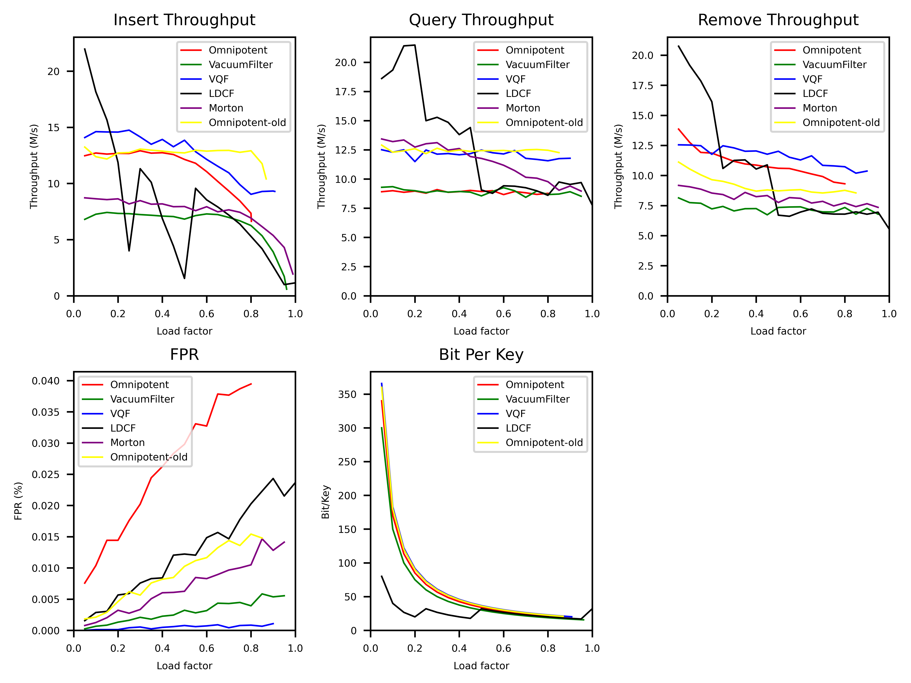
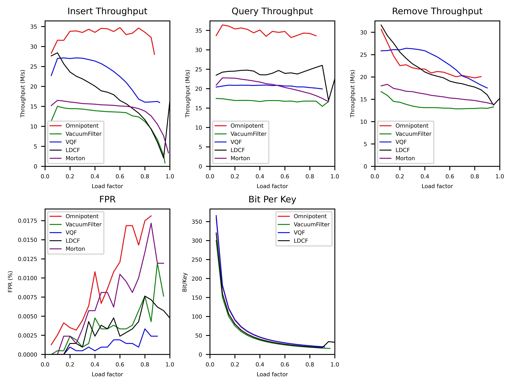
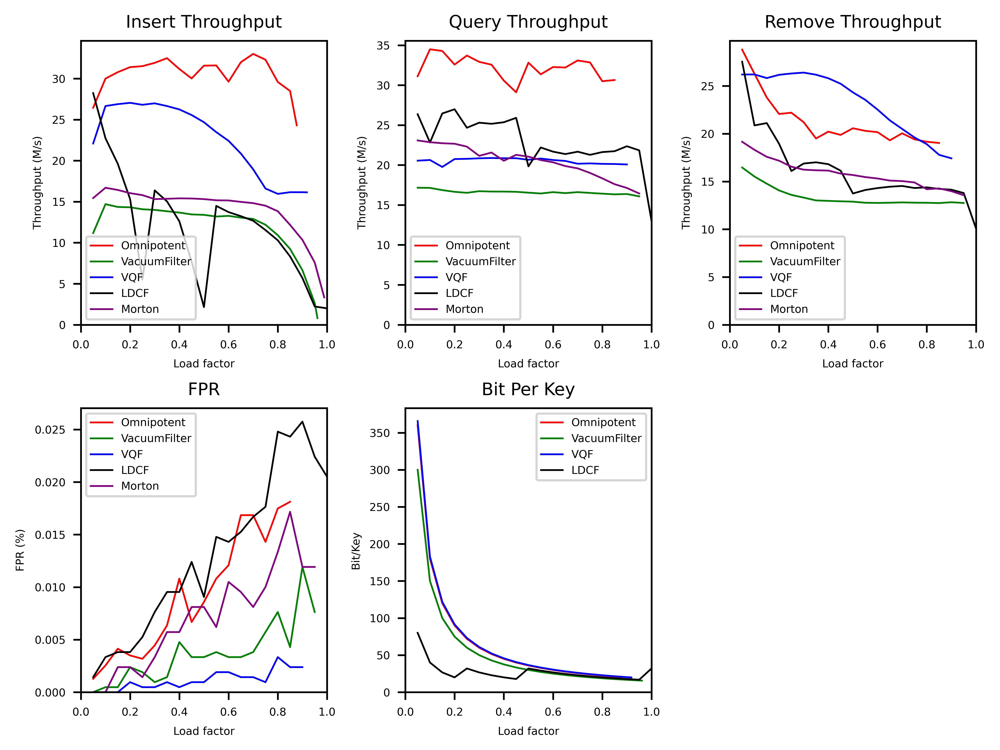
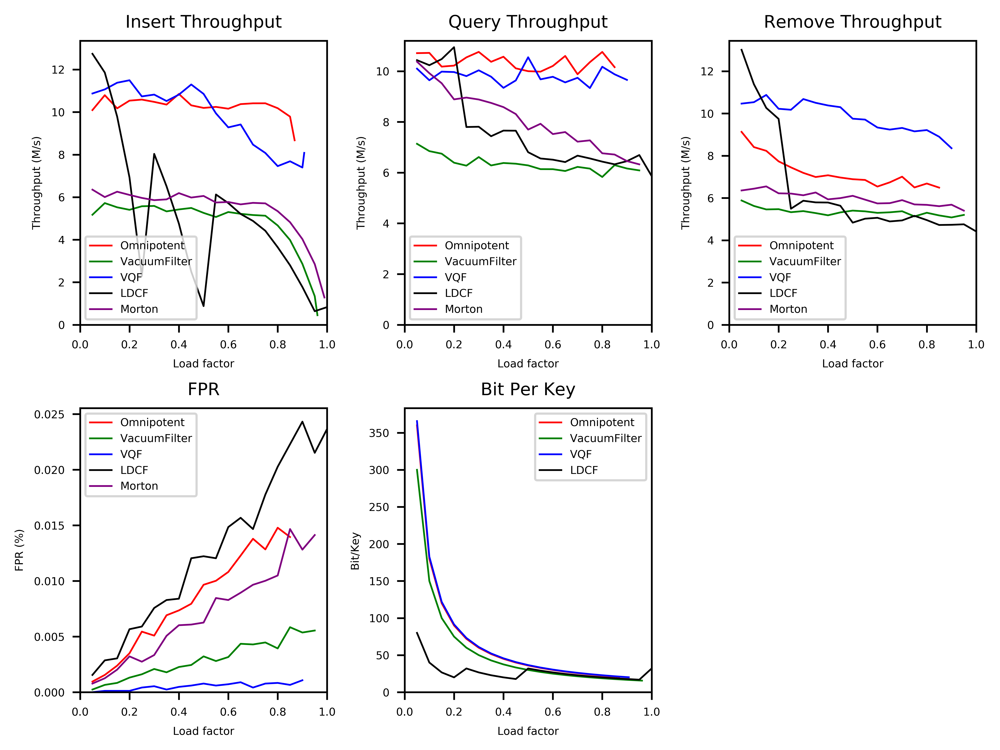
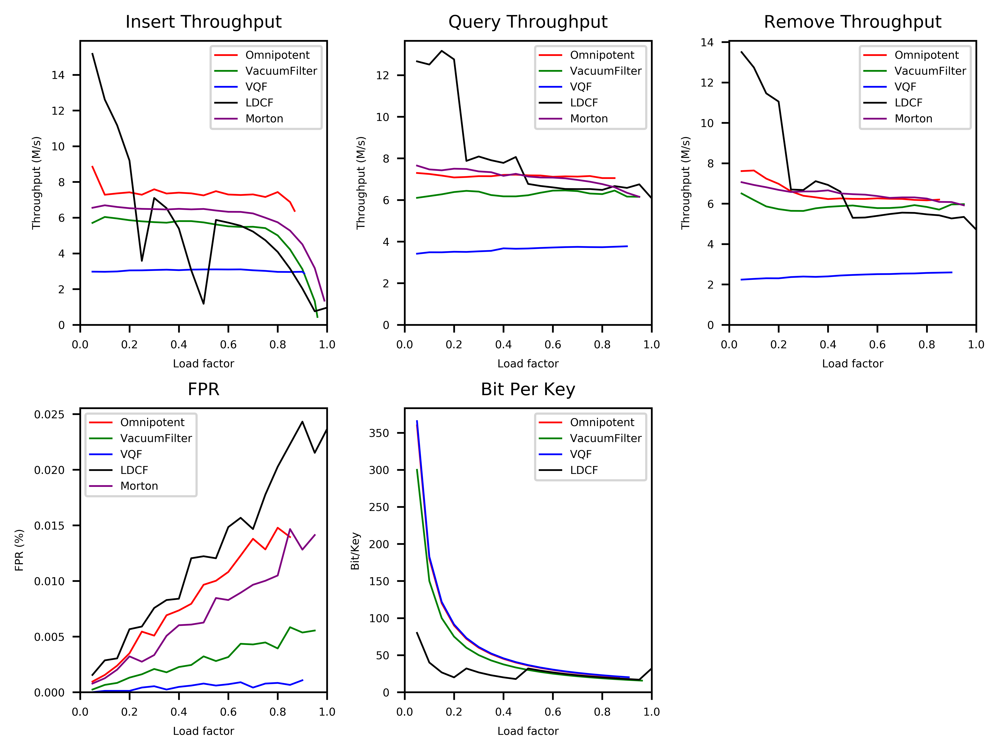
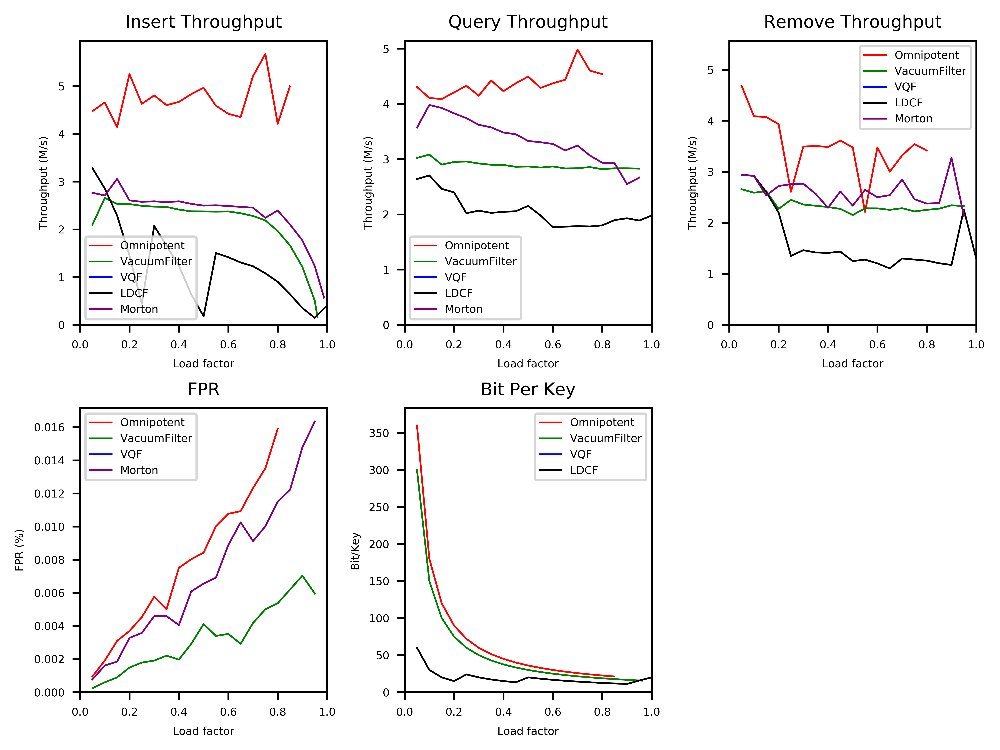
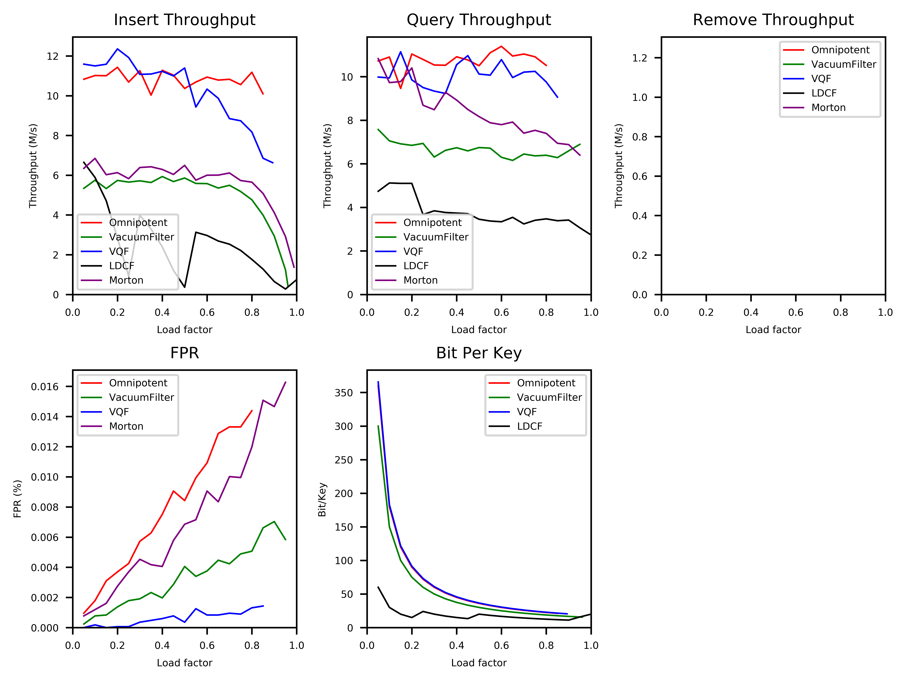
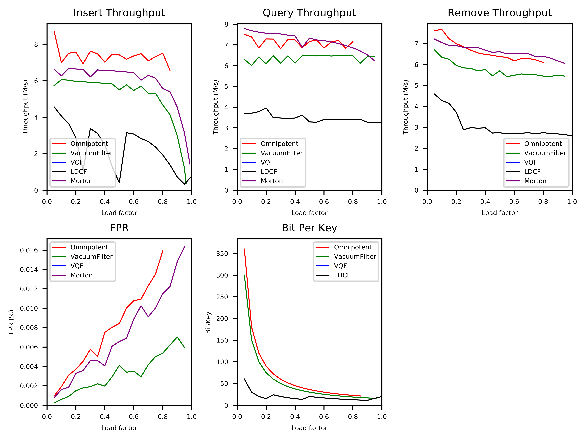
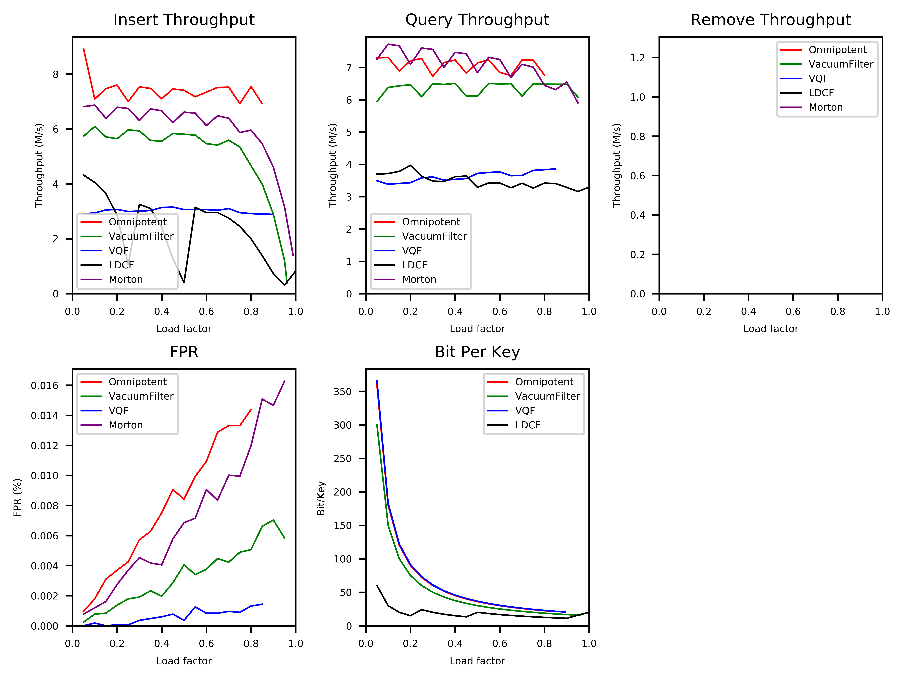

## todo-list

- fix load factor，绘制bpk-fpr图像
- 调优新写的适配于动态版本的omnipotent
- **收集之前实验结果的log**  例如12.31的n是多大？（听说比较小）
- 为什么LDCF变得那么快？
- 弄清楚不同filter用的memory，弄清楚我们的trade off

## log

### 2022/01/22

#### result:

Transferred to new Ali Cloud server. Results using default config in github:

 

### 2022/01/06

#### Issues:

- 为什么FPR抖动？
- 为什么CF在load factor低的时候就开始下降了？

### 2021/12/31

#### description:

阿里云Intel机器，omnipotent filter使用SIMD加速

#### result:

static LDCF:

 

dynamic LDCF:

 

#### Issues:

### 2021/12/23

#### result:

local:

 

server:

 

#### Issues:

### 2021/12/9

#### result:

local:

 

server:

#### Issues:

- throughput 在 server 上振动
- vqf 如果 remove 就挂
- 需要 fix load factor，绘制 bpk-fpr 图像
- 需要实现多次测试取average performance
- 需要实现静态LDCF
